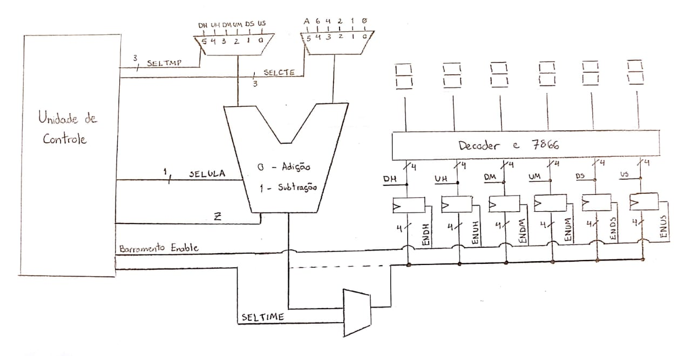

# Projeto 1: Relógio Digital - Design de Computadores

Leonardo Medeiros, Martim Ferreira José e Sabrina Simão  
Engenharia da Computação - Insper

## Descrição
Este projeto consistiu na criação de um relógio digital com as seguintes características:
* Indica horas, minutos e segundos
* Possui sistema para acertar o horário;
* Possui seleção da base de tempo
    * Para mostrar a passagem das 24 horas em tempo reduzido
  
Opcionais que adicionam valor ao projeto:
* Sistema de despertador;
* Temporizador com contagem regressiva;
* Implementação microprogramada;

## Requisitos
* Deve ser feito em VHDL;
* Deve utilizar um fluxo de dados contendo uma ULA:
    * Responsável pelos cálculos envolvidos na contagem de tempo;
* O controle desse fluxo de dados pode ser através de:
    * Máquina de estados finitos;
    * Microprogramado.
* O horário deverá ser mostrado através do display de sete segmentos da placa FPGA DE2-115

## O projeto
### Fluxo de dados
