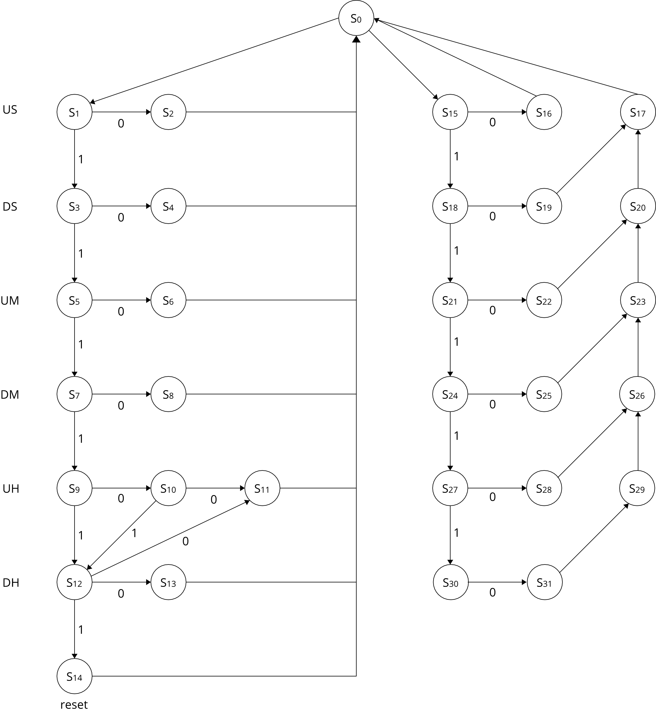

# Projeto 1: Relógio Digital - Design de Computadores

Leonardo Medeiros, Martim Ferreira José e Sabrina Simão  
Engenharia da Computação - Insper

## Descrição
Este projeto consistiu na implementação de um relógio digital, que indica as horas, minutos e segundos, em uma placa FPGA DE2-115. O relógio possui um sistema que acerta o tempo e outro que muda a seleção da base de tempo, podendo alterar entre a visualização de 12h e 24h. O projeto foi programado em VHDL no programa Intel Quartus e foi dividido em fluxo de dados, unidade de controle e top level. O projeto pode ser visto funcionando no vídeo abaixo:

No projeto, há um modo que possibilita a alterar o horário do relógio. Isso pode ser feito pelo Switch 0 da placa, que ao ser ativado, pausa o timer e ativa a edição. A partir disso, o usuário pode utilizar os Switchs de 17 a 8, que representam os números 0 a 9. Após selecionar a constante desejada, ela pode ser setada por meio dos botões à direita da placa, que estão em ordem representando os dígitos do relógio (não é possível editar os segundos do relógio). Após setar o horário preterido, o relógio pode dar continuidade a contagem desabilitando o Switch 0 da placa.

Outra funcionalidade do projeto é alterar a velocidade com que as ações do relógio ocorrem, isto é, mudar o clock do sistema. Isso pode ser feito por meio dos Switchs 1 a 4, sendo o primeiro mais devagar e o quarto mais rápido. Só é possível ativar uma velocidade por vez e a velocidade padrão é o período de tempo de segundo. Para alterar entre as bases de tempo 12h e 24h, usa-se o Switch 5, que desativado (padrão) é 24h. E por último, foi implementado um cronômetro que conta até zero (countdown), pode ser ativado pelo Switch 6.

## Fluxo de dados
No [fluxo de dados](../master/Relogio/FluxoDados.vhd) temos a visão geral de como os componentes do relógio se relacionam e como se conectam.

Como pode ser visto, temos um [MUX](../master/Relogio/Mux.vhd) (Multiplexador) que tem como entrada os [Registradores](../master/Relogio/Registrador.vhd) de cada unidade de hora do relógio, que são selecionadas a partir do seletor `SELTMP`. 

Ao seu lado, temos outro [MUX](../master/Relogio/Mux.vhd) que tem como entrada as constantes que temos que comparar para verificar se é preciso incrementar a atual unidade de hora. A escolha da constante é feita pelo seletor `SELCNT`.

As "comparações" e a incrementações são feitas pela [ULA](../master/Relogio/ULA.vhd) (Unidade Lógica e Aritmética), que tem duas funções: adição e subtração. A adição é sempre feita com quando o seletor `SELULA` é `0`, incrementando uma unidade ao valor de entrada. Já a subtração, é realizada quando o seletor `SELULA` é `1`, subtraindo os dois valores e possivelmente ativando a flag Z, que indica que o resultado é zero. Neste caso, as entradas da ULA são os dois MUX com as constantes e com os valores do registradores.

A saída da ULA é o resultado da incrementação ou da subtração, que é ligada ao registrador que está sendo utilizado. Este registrador é especificado entre os outros por meio do `Enable`. Pelo diagrama é possível ver que cada [Registrador](../master/Relogio/Registrador.vhd) é ligado ao [Decorder](../master/Relogio/conversorHex7Seg.vhd) de sete segmentos, que manda o sinal para placa exibir o número em questão.

Abaixo da ULA temos um outro MUX, que é usado para alterar a entrada dos registradores entre a ULA e uma variável vinda da unidade de controle (Top Level), o que basicamente é a hora definida no *setup* do horário. O valor seletor do MUX é definido por um Switch na placa FPGA, que habilita e desabilita a edição.

## Unidade de Controle
A unidade de controle é a máquina de estados que vai controlar a ordem na qual o fluxo de dados irá ocorrer. Para implementar o relógio, foi preciso pensar em como mudar a unidade de tempo assim que ela atingisse o seu máximo de forma cíclica. A seguir estão os máximos para cada unidade de tempo:
* **Unidade de segundo (US):** 10
* **Dezena de segundo (DS):** 6
* **Unidade de minuto (UM):** 10
* **Dezena de minuto (DM):** 6
* **Unidade de hora (UH):** 4 (base de tempo 24h) ou 2 (base de tempo 12h)
* **Dezena de hora (DH):** 2 (base de tempo 24h) ou 1 (base de tempo 12h)

Obs: Esses números são as constantes do primeiro MUX ([Fluxo de Dados](#fluxo-de-dados))

A máquina de estados implementada pode ser observada pelo diagrama a seguir:

No diagrama, é possível observar que temos 2 grupos de estados, na esquerda o funcionamento básico do relógio e a direita o funcionamento de um timer countdown. Cada linha da máquina de estados representa um número do relógio, por exemplo: a primeira linha se refere a unidade de segundos (US), a segunda se refere a dezena de segundos (DS), a terceira é unidade de hora (UM) e assim por diante... No primeiro grupo, temos um estado que compara (subtração) o valor em questão e outro estado que incrementa 1. No segundo grupo, a primeira coluna compara o valor em questão, a segunda coluna decrementa 1 e a terceira coluna adiciona 6 ou 9 ao valor em questão.

Cada um dos estados têm uma saída específica de 19 bits que é a instrução que irá para o Top Level. A instrução é constituída pelo SELCNT, SELTMP, SELULA, Enables e Reset. Para exemplificar, temos abaixo 3 estados diferentes, adição da unidade de segundo, subtração da dezena de minuto e adição na unidade de hora.

| Descrição do bit | SELCNT 0:3 | SELTMP 0:3 | SELULA | Enable 0:5 | Reset 0:5 |   |     Output 0:18     |
|:----------------:|:----------:|:----------:|:------:|:----------:|:---------:|:-:|:-------------------:|
|     Adição US    |     001    |     000    |    0   |   100000   |   000000  |   | 0010000100000000000 |
|   Subtração DM   |     100    |     011    |    1   |   000000   |   000000  |   | 1000111000000000000 |
|     Adição UH    |     001    |     100    |    0   |   000010   |   111100  |   | 0011000000010111100 |

Se quisermos fazer incrementar 1 no registrador da unidade de segundos, precisamos enviar para o Top Level a seguinta instrução: `0010000100000000000`. Que se traduz em carregar a entrada 1 do MUX de constantes, carregar a entrada 0 do MUX de registradores, carregar a função 0 na ULA, carregar 1 no enable do registrador 1, 0 no enable dos outros registradores e carrega 0 no reset de todos os registradores. Isto é, soma o valor do registrador US com 1 e guarda no registrador US.

Para fazer a subtração (comparação) da dezena de minuto, precisamos enviar para o Top Level a seguinte instrução: `1000111000000000000`. Que se traduz em caregar a entrada 4 do MUX de constantes, carregar a entrada 3 do MUX de registradores, carregar a função 1 na ULA, carregar 0 no enable e reset de todos os registradores. Isto é, subtraí o valor do registrador DM por 6 e devolve o resultado da comparação.

Para incrementar 1 no registrador da unidade de hora, precisamos enviar para o Top Level a seguinte instrução: `0011000000010111100`. Que se traduz em caregar a entrada 1 do MUX de constantes, carregar a entrada 4 do MUX de registradores, carregar a função 0 na ULA, carregar 1 no enable do registrador 5 e 0 no enable dos outros registradores, carregar 1 no reset nos registradores de 1 a 4 e carregar 0 nos últimos 2 registradores. Isto é, soma o valor do registrador UH com 1, guarda o resultado no registrador UH e reseta os registradores US, DS, UM e DM.

## Top Level
O top level do projeto une as duas parter do projeto: Unidade de Controle com o Fluxo de dados. Vindo da Unidade de controle, temos a instrução que o fluxo de dados deve executar para performar a ação necessária do relógio. Foi nesta parte do projeto que foram implementadas todos os features de velocidade do timer, modificação do horário e ativação do modo countdown.