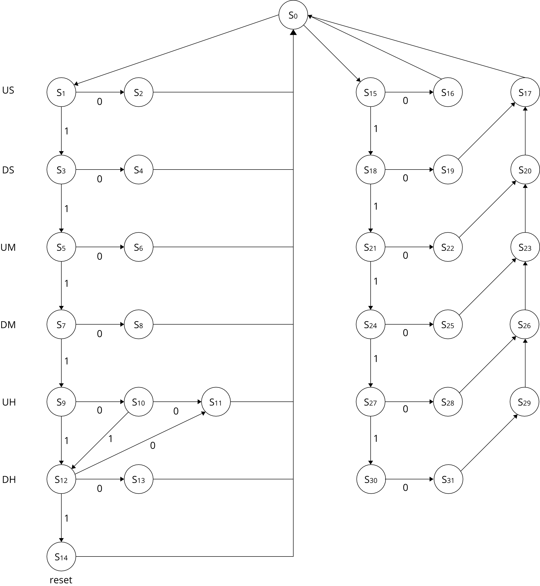

# Máquina de Estados
A máquina de estados implementada pode ser observada pelo diagrama a seguir:

## Tabela Fluxo 1 (esquerda)
### Adição

**Estados:** S2, S4, S6, S8, S11, S13

| Descrição do bit | SELCNT 0:3 | SELTMP 0:3 | SELULA | Enable 0:5 | Reset 0:5 |   |     Output 0:18     |
|:----------------:|:----------:|:----------:|:------:|:----------:|:---------:|:-:|:-------------------:|
|   Adição US +1   |     001    |     000    |    0   |   100000   |   000000  |   | 0010000100000000000 |
|   Adição DS +1   |     001    |     001    |    0   |   010000   |   100000  |   | 0010010010000100000 |
|   Adição UM +1   |     001    |     010    |    0   |   001000   |   110000  |   | 0010100001000110000 |
|   Adição DM +1   |     001    |     011    |    0   |   000100   |   111000  |   | 0010110000100111000 |
|   Adição UH +1   |     001    |     100    |    0   |   000010   |   111100  |   | 0011000000010111100 |
|   Adição DH +1   |     001    |     101    |    0   |   000001   |   111110  |   | 0011010000001111110 |

### Comparação (Subtração)

**Estados:** S1, S3, S5, S7, S9, S10, S12

|  Descrição do bit  | SELCNT 0:3 | SELTMP 0:3 | SELULA | Enable 0:5 | Reset 0:5 |   |     Output 0:18     |
|:------------------:|:----------:|:----------:|:------:|:----------:|:---------:|:-:|:-------------------:|
|   Subtração US -9  |     101    |     000    |    1   |   000000   |   000000  |   | 1010001000000000000 |
|   Subtração DS -5  |     100    |     001    |    1   |   000000   |   000000  |   | 1000011000000000000 |
|   Subtração UM -9  |     101    |     010    |    1   |   000000   |   000000  |   | 1010101000000000000 |
|   Subtração DM -5  |     100    |     011    |    1   |   000000   |   000000  |   | 1000111000000000000 |
| Subtração UH -3/-2 |     011    |     100    |    1   |   000000   |   000000  |   | 0111001000000000000 |
|   Subtração UH -9  |     101    |     100    |    1   |   000000   |   000000  |   | 1011001000000000000 |
|   Subtração DH -2  |     010    |     101    |    1   |   000000   |   000000  |   | 0101011000000000000 |

## Tabela Fluxo 2 (direita)
### Subtração

**Estados:** S16, S19, S22, S25, S28, S31

| Descrição do bit | SELCNT 0:3 | SELTMP 0:3 | SELULA | Enable 0:5 | Reset 0:5 |   |     Output 0:18     |
|:----------------:|:----------:|:----------:|:------:|:----------:|:---------:|:-:|:-------------------:|
|  Subtração US -1 |     001    |     000    |    1   |   100000   |   000000  |   | 0010001100000000000 |
|  Subtração DS -1 |     001    |     001    |    1   |   010000   |   000000  |   | 0010011010000000000 |
|  Subtração UM -1 |     001    |     010    |    1   |   001000   |   000000  |   | 0010101001000000000 |
|  Subtração DM -1 |     001    |     011    |    1   |   000100   |   000000  |   | 0010111000100000000 |
|  Subtração UH -1 |     001    |     100    |    1   |   000010   |   000000  |   | 0011001000010000000 |
|  Subtração DH -1 |     001    |     101    |    1   |   000001   |   000000  |   | 0011011000001000000 |

### Adição

**Estados:** S17, S20, S23, S26, S29

| Descrição do bit | SELCNT 0:3 | SELTMP 0:3 | SELULA | Enable 0:5 | Reset 0:5 |   |     Output 0:18     |
|:----------------:|:----------:|:----------:|:------:|:----------:|:---------:|:-:|:-------------------:|
|   Adição US +9   |     101    |     000    |    0   |   100000   |   000000  |   | 0010001100000000000 |
|   Adição DS +5   |     100    |     001    |    0   |   010000   |   000000  |   | 1010000100000000000 |
|   Adição UM +9   |     101    |     010    |    0   |   001000   |   000000  |   | 1000010010000000000 |
|   Adição DM +5   |     100    |     011    |    0   |   000100   |   000000  |   | 1010100001000000000 |
|   Adição UH +9   |     101    |     100    |    0   |   000010   |   000000  |   | 1000110000100000000 |

### Comparação (Subtração)

**Estados:** S15, S18, S21, S24, S27, S30

| Descrição do bit | SELCNT 0:3 | SELTMP 0:3 | SELULA | Enable 0:5 | Reset 0:5 |   |     Output 0:18     |
|:----------------:|:----------:|:----------:|:------:|:----------:|:---------:|:-:|:-------------------:|
|  Subtração US -0 |     000    |     000    |    1   |   100000   |   000000  |   | 0000001100000000000 |
|  Subtração DS -0 |     000    |     001    |    1   |   010000   |   000000  |   | 0000011010000000000 |
|  Subtração UM -0 |     000    |     010    |    1   |   001000   |   000000  |   | 0000101001000000000 |
|  Subtração DM -0 |     000    |     011    |    1   |   000100   |   000000  |   | 0000111000100000000 |
|  Subtração UH -0 |     000    |     100    |    1   |   000010   |   000000  |   | 0001001000010000000 |
|  Subtração DH -0 |     000    |     101    |    1   |   000001   |   000000  |   | 0001011000001000000 |